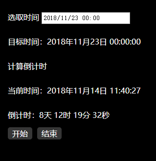
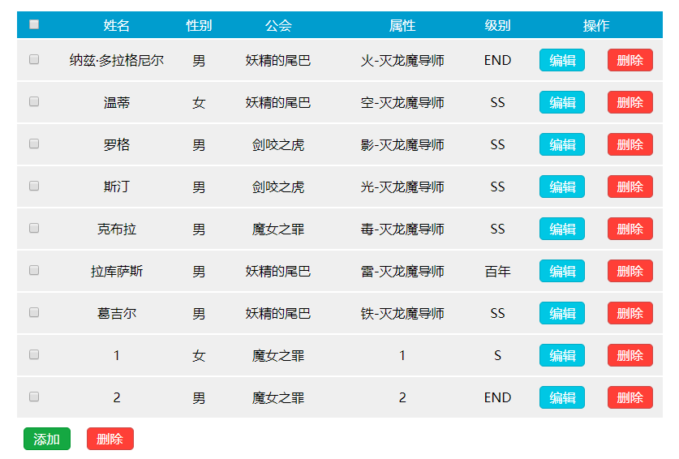
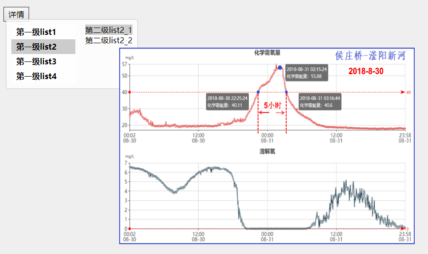
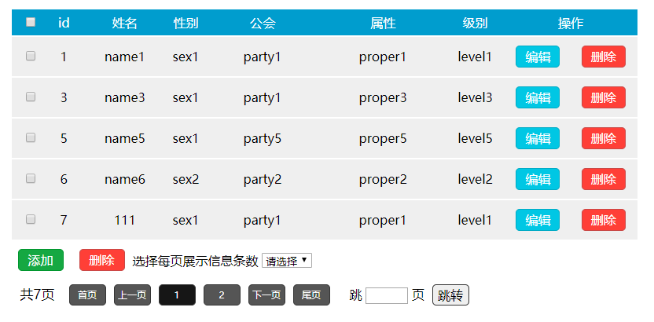
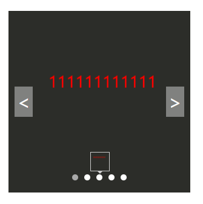
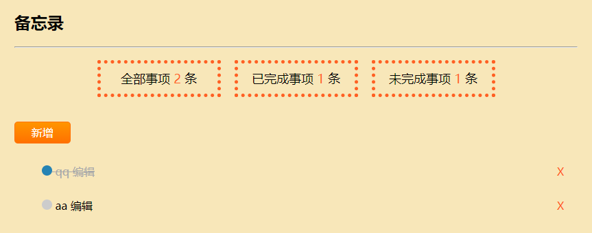
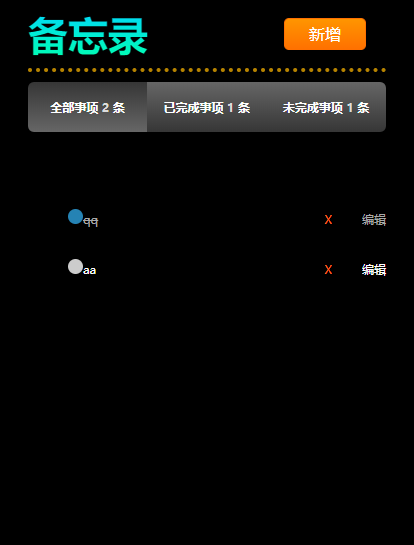

# calendar
- 日历插件
- 显示阴历，显示阳历阴历的节假日
- 可以跳回当前日期

# countdown
- 日期倒计时
- input输入框选择日期时刻
- 显示当前时间
- 计算时间差值

# CRUD
- 表格增删改demo
- 可编辑，可单项删除，可批量删除
- 模拟服务器环境下启动

# imgfloat
- 图片支持鼠标滚轮缩放
- 鼠标拖拽

# page
- 表格增删改添加了分页功能
- 每页显示的数据条数可控

# shopcar
- 模拟购物车
- 商品数量增减
- 删除商品
- 全选全不选
- 实时改变价钱数量

# slider
- 简单轮播图
- 悬浮显示缩略图
- 左右切换

# sort
- 对象中某一属性作为关键字进行排序
- 汉字根据转换的Unicode进行排序

# tab
- 模拟手风琴菜单
- 本地json模拟后台数据
- 切换tab显示不同内容

# todo
- 模拟备忘录
- 添加待办事件
- 改变事件状态

# todo2
- 模拟备忘录
- 添加待办事件
- 改变事件状态
- 切换tab显示
- 适配手机屏幕

